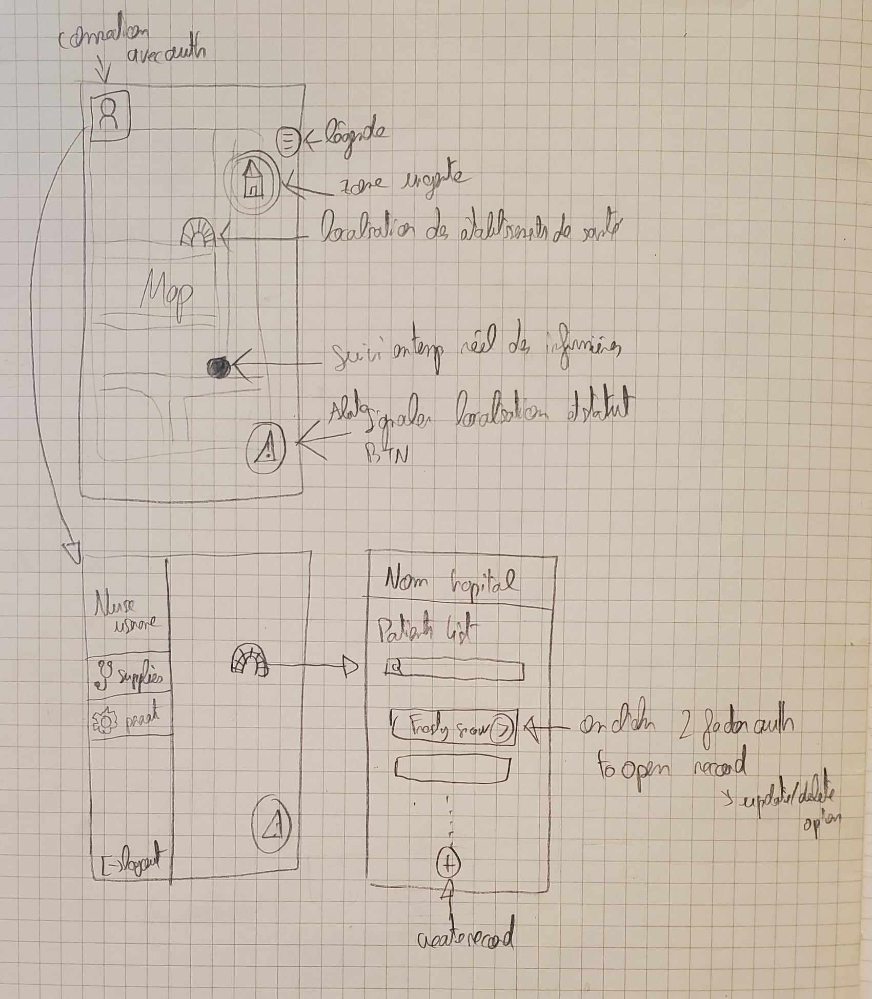
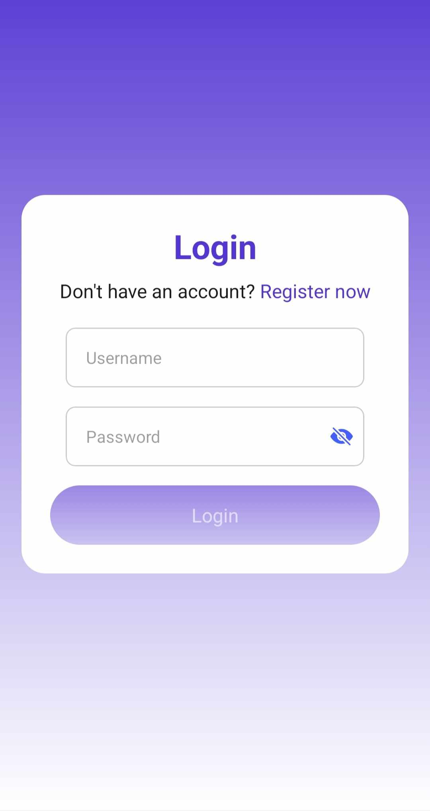
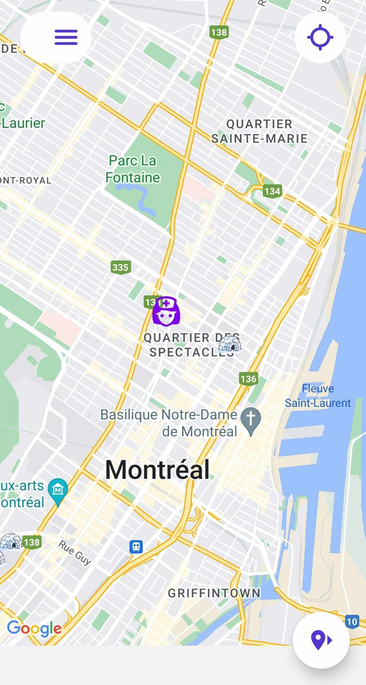
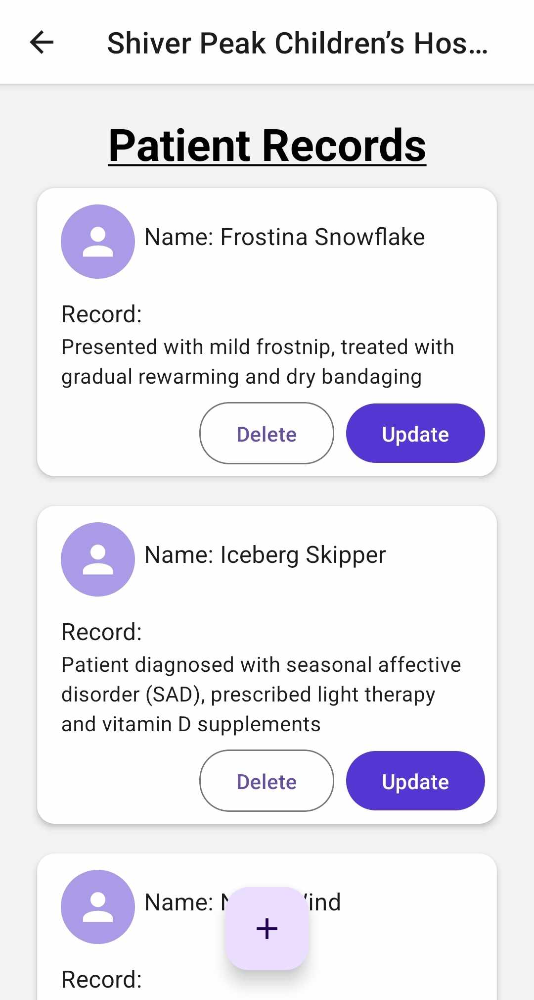
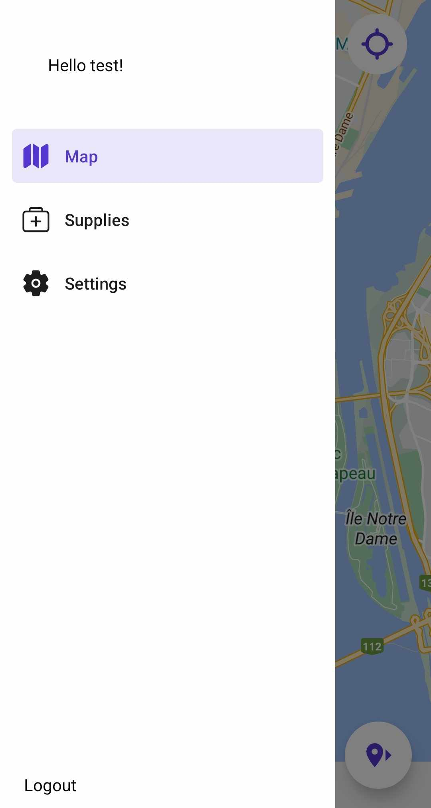
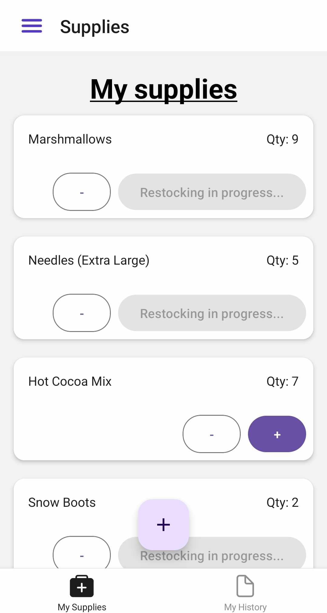
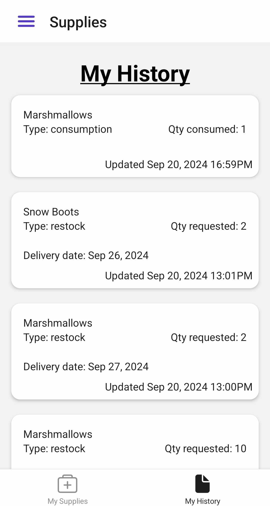

# Nurseomator - Juliette Guilbaud

I chose this project because I found it very interesting from a technical point of view, as well as having a lot of potential for a nice user interface. As I read it I already had lots of ideas for fcontionnalities and how to implement them. I quickly realized that it was with this project that I could best demonstrate my backend and frontend skills.

# My tech stack

### Backend

-   **Node.js** with **Express**
-   Database: **PostgreSQL**

#### Docker

I've chosen to use docker for the backend and database to avoid any problems associated with multiple development environments. With Docker I'm sure that the application will behave in the same way on all machines.

---

### Frontend : Mobile App

-   **React Native** for a cross-platform mobile application
-   **Expo** : I used the expo framework to simplify the development. I didn't have to worry about basic configurations and the devleopmnt was much faster. Expo also offers the ability to preview apps on devices in real-time without needing native code configurations.

-   For the map: **React Native Maps**

-   For http requests: **Axios**

# Local setup

## Git

Clone git repo : https://github.com/JulietteGuilbaud/gom-jabbar

## Environment variables

> Please note! In a professional and security context my .env files will not be pre-filled. To speed up your inital installation I've left all access to the database & my tokens.

The only thing missing is your local IP address so that the mobile app on your phone can communicate with your local backend:

-   In the nurseomator-app .env file : `gom-jabbar/Nursomator/nurseomator-app/.env`, modify the `EXPO_PUBLIC_API_URL` to match your local IP address. Leave the port 5001 at the end.

## Backend & DB

> Please note! In a professional and security context I would not expose the database like this.

-   Make sure docker is open on your computer.

-   In your terminal, go to the docker folder:`cd gom-jabbar/Nursomator/backend/src/docker`

-   Start containers: `docker compose up -d` (if later you want to stop the containers run: `docker compose down`)

This will fetch my backend docker image and the postgres docker image with my database populated.

## Frontend

-   In your terminal, go to the nurseomator-app folder: `cd gom-jabbar/Nursomator/nurseomator-app`
-   Install dependencies: run `npm install`
-   Start the projet: run `npm start`

Expo is displaying multiple ways to see the app. use the QR code to download the expo app and see my app on your device.
You can also test on ios simulator or android. Web is not working as I'm using React Native Maps to render the map which is a framework only for mobile.

> Make sure you are on the same Wi-Fi network on your computer and your device if you test on a real device.

## Test nurse account

You can login as username:`test` & password:`test` to test all features.

# Postman collection

I used postman during development, so you'll find the postman collection in the project: `NurseomatorAPI.postman_collection.json`. You can import it in postman.

You would need to have a local environnemnt with thoses 2 variables:

-   `base_url`: your local ip address with port 5001 or localhost. Ex: http://192.1.2.3:5001
-   `authToken`: the authToken of the nurse you've registered and login

# Jest tests

I've created some tests for backend routes. You can run the test suites in the backend docker container:

-   Run: `docker ps` to get the backend container name
-   Run: `docker exec -it <container_name> /bin/bash`
-   Run: `npm run test`

# Details on implementation and functionalities

I started the project by drawing the beginnings of a user interface. This allows me to define and list the functions to be implemented.



## Authentication

As some of the data stored in the application is sensitive, access to the app is restricted to nurses with an account. For the time being, anyone can register, but the idea in the future is to implement email verification or multi-factor authentication for even greater security.

As a nurse register or login, I generate a jwt auth token (with) **jsonwebtoken**. This token will be stored on the mobile's local storage and is required for all sensitive requests on the application. There are stored securely with **expo-secure-store** which provides a way to encrypt and securely store key–value pairs locally on the device.

The nurse account is also protected by a password which is hashed in the database with **bcryptjs**.

Backend routes:

-   POST /nurse/register
-   POST /nurse/login
-   GET /nurse/ -> protected with auth token
-   DELETE /nurse/:id -> protected with auth token

Backend table: `nurses` with

```
  username: VARCHAR(100)
  password: VARCHAR(255)
```



## Map

The main screen of the app is the map screen.



> Problem with the size of the map not taking up the whole screen, which I haven't had time to correct.

When you open the application for the first time, you'll be asked to consent to having your location tracked.

-   The purple nurse icon symbolizes your position. You can press it to see your username. By pressing the location icon on the top right, the map will automatically move to your position.

## Send nurse location

-   The send location icon at bottom right allows the nurse to send her position and status to the database. This information can then be used by another service, for example to locate all the nurses on a map, or to assist a nurse who has pressed SOS. Note that the position of the button at the bottom right of the screen is close to the thumbs, and that the SOS button is first on the list, so that a nurse in danger can quickly send her position and status.

Backend routes:

-   POST /location/report -> protected with auth token
-   GET /location/status-options -> to display the correct status text

Backend table: `locations` with

```
    nurse_id: INTEGER -> ref to nurses(id)
    latitude: DECIMAL
    longitude: DECIMAL
    status: ENUM one of Patient care, In motion, At rest, SOS
```

## Facilities

-   On the map, you can navigate around Montreal and see 10 healthcare facilities represented by an igloo. By clicking on a facility, you'll be able to view all the patient records held there.

Backend routes:

-   GET /facility/list

Backend table: `facilities` with

```
    name: VARCHAR(100)
    latitude: DECIMAL
    longitude: DECIMAL
```

## Patient Records

Each patient record belongs to one facility. A nurse can create, update or delete a patient record. As patient records are sensitive data, when the nurse creates a patient record, the record value is encrypted with **crypto**. The value is then decrypted when we want to display it.

Backend routes:

-   POST /patient-record/ -> protected with auth token, create a patient record
-   GET /patient-record/:id -> protected with auth token
-   GET /patient-record/list-for-facility/:facility_id -> protected with auth token
-   PUT /patient-record/:id -> protected with auth token, update a patient record
-   DELETE /patient-record/:id -> protected with auth token, delete a patient record

Backend table: `patient_records` with

```
    facility_id: INTEGER  -> ref to facilities(id)
    patient_name: VARCHAR(100)
    record: TEXT

```



## Drawer

-   By pressing on the menu icon on the top left you will open the drawer menu.
-   At the bottom of the drawer you can find the logout button to logout your nurse.



## My supplies & My history

-   The screen display the list of your nurse's supplies. You can see the supply name which comes from the `supplies` table. The quantity and restocking_in_progress fields are coming from the nurse entry in the `nurse_supplies` table.

-   **Request**: When a nurse presses the + or - button, she requests restock or consumption of the current supply. A modal appears allowing the nurse to enter the requested quantity. Each time a nurse requests something I create an entry in the `supplies_history` table. In this entry I save the quantity requested, the type of request (restock or consumption) and, in the case of restock, a delivery date. In fact, I simulate a delivery date for restock, which is why the quantity is not updated when you press the + button. Instead, the + button is deactivated because the restock request is in progress. In the future, we can imagine a script running every day to see if the delivery date has passed, if so the script will change the restocking_in_progress field to false in the `nurse_supplies` table.

-   For example, for the nurse's `test` and in the screenshots below, the nurse requested 10 marshmallows which were delivered. Then, the nurse requested 2 more marshmallows, to be delivered on September 27. In the meantime, the nurse consumed 1 marshmallow. 10 - 1 = 9. The nurse now has 9 marshmallows and will have 11 after September 27.

Backend routes:

-   GET /supply/my-supplies -> protected with auth token
-   POST /supply/restock -> protected with auth token
-   POST /supply/consumption -> protected with auth token
-   GET /supply/request-options
-   GET /supply/my-history -> protected with auth token

Backend table: `supplies` with

```
  name VARCHAR(100)
```

Backend table: `nurse_supplies` with

```
    nurse_id: INTEGER  -> ref to nurses(id)
    supply_id: INTEGER  -> ref to supplies(id)
    quantity: INTEGER
    restocking_in_progress: BOOLEAN
```

Backend table: `supplies_history` with

```
    nurse_supply_id: INTEGER  -> ref to nurse_supplies(id)
    type: ENUM IN ('consumption', 'restock')
    quantity: INTEGER
    delivery_date: TIMESTAMP
```



