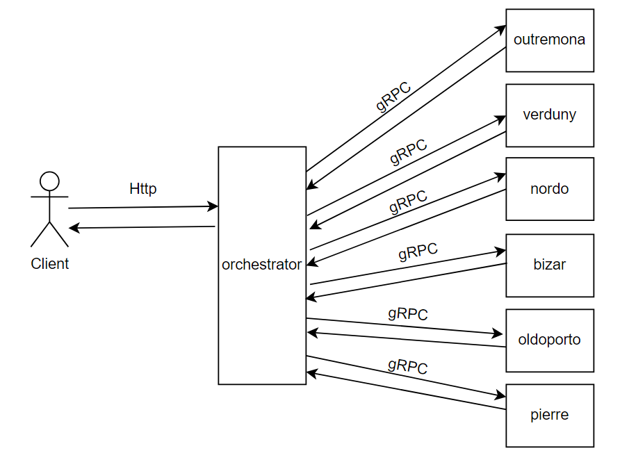
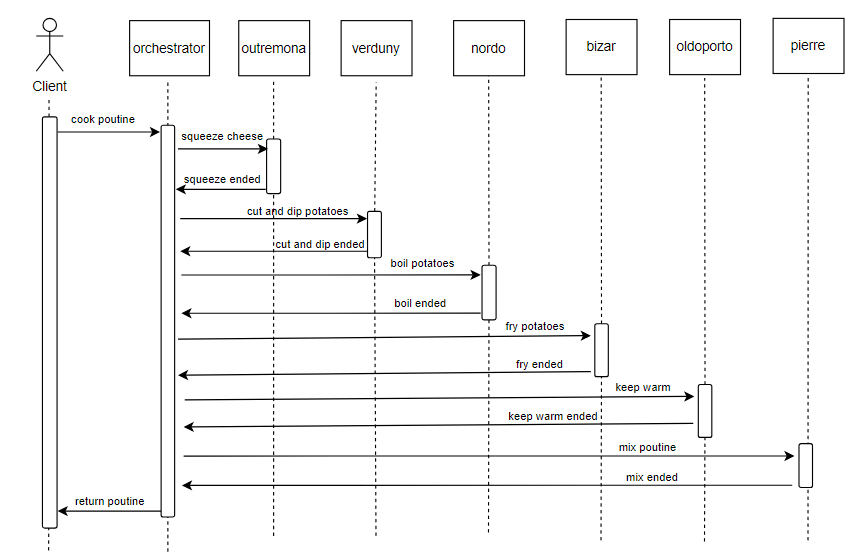

# Ma solution pour le projet SmokedMeater ("Accelerating poutine production")

## Introduction
Tout d'abord, je voulais vous remercier pour l'opportunité que vous m'avez donnée et vous mentionner que j'ai trouvé le projet intéressant, car j'ai pu mettre à profit mes connaissances et apprendre de nouveaux concepts. 

## Explication de l'architecture

Pour la solution, je me suis questionné au départ s'il était mieux de faire un seul serveur avec différents "endpoints" REST, mais le problème demandait de faire une API REST pour chaque robot ce qui m'a fait penser directement à une architecture orientée microservices. Ainsi, chaque robot est sur un serveur à part entière avec son code et ses fonctions correspondantes.

Cette architecture orientée microservices permet de rendre le code plus lisible et de mieux séparer les responsabilités. Les robots et leurs codes seront aussi plus découplés ce qui peut être plus facile à maintenir et à mettre à l'échelle lorsque le système devient plus complexe.
Pour implémenter cette architecture, j'ai donc fait en sorte de faire plusieurs dossiers (un dossier par robot) et d'ajouter un dossier qui porte le nom d'orchestrateur. Cet orchestrateur est en fait un serveur central qui permettra de recevoir des requêtes REST du client et qui pourra ensuite diriger la préparation de la poutine en communiquant avec les différents robots comme le montre ce schéma: 



Comme on peut le voir dans le schéma de l'architecture, j'ai décidé d'utiliser gRPC pour la communication entre l'orchestrateur, car cela permet l'envoi de messages plus rapidement et plus efficacement. Aussi, selon les besoins du système, il y a moyen d'avoir une communication bidirectionnelle en temps réel. Dans le futur, si on veut que les robots communiquent entre eux ou avec l'orchestrateur en temps réel, on pourra simplement modifier les fichiers proto et ajouter les différentes méthodes nécessaires.

J'ai aussi créer un diagramme de séquences qui permet de montrer le processus de création de poutine impémenté présentement : 



Les paramètres considérées par le système pour la création de la poutine sont: 
- la taille des cubes de pommes de terre
- le temps pour mettre les pommes de terre à bouillir
- l'huile utilisée pour la friture
- la température à laquelle on veut chauffer la sauce spéciale. 

On peut donc modifier un ou plusieurs de ces 4 paramètres et avoir tout de même une poutine qui se prépare sans problème.

Pour ce qui en est de la détection des gens qui ont faim, il faut mettre un paramètre (qui est un booléen) pour indiquer si une personne a été détectée ou non.

## Technologies utilisées

J'ai utilisé TypeScript, Node.js, express, gRPC et Jest pour les tests dans l'orchestrateur.

Le serveur de l'orchestrateur a une Rest API qui suit le format OpenAPI (voir le fichier openapi.yaml dans le dossier de l'orchestrateur).

Pour ce qui en est de la création des services gRPC, les fichiers proto sont rassemblés dans le dossier protos.

J'ai utilisé ChatGPT pour m'aider à faire la suite de tests plus rapidement, car plusieurs services dans l'orchestrateur se ressemblaient.

## Choses à améliorer

J'ai malheureusement manqué de temps pour accomplir les tests dans chaque serveur. J'ai priorisé les tests dans l'orchestrateur, car la majorité du code se trouve là et que le processus de création de poutine se trouve implémenté dans celui-ci. Préférablement, il faudrait :
- des tests unitaires dans chaque serveur afin de s'assurer que les fonctions des différents robots agissent comme prévu.
- des tests d'intégrations qui permettraient de voir si la communication entre différents microservices (robots) fonctionne comme il se doit. 

Pour le code en général, j'aurai peut-être pu améliorer mon système en faisant en sorte d'avoir des méthodes gRPC qui permettent la communication bi-directionnelle ou en temps réel, mais c'était la première fois que j'implémentais ce type de communication dans un projet ce qui m'a permis d'enrichir mes connaissances.
Aussi, certaines tâches dans le processus de création de la poutine auraient pu s'exécuter parallèlement comme les tâches impliquant le fromage et les pommes de terre. Je pense que j'aurai pu faire en sorte de faire un appel non séquentiel pour les robots qui s'occupaient de ces tâches là afin de rendre plus efficace la préparation.

## Instructions pour lancer le projet

1. **Aller dans le dossier SmokedMeater et lancer le script setup.sh (donner les permissions avant)**
   ```bash   
   chmod +x ./setup.sh  
   ./setup.sh
Ce script va permettre d'installer automatiquement les node_modules dans chacun des microservices (Robot). 
   
2. **Si vous utilisez Visual Studio Code, vous pouvez ensuite lancer une tâche (Run task) et choisir l'option "start-all-servers" dans le menu de sélection qui sera affiché**

Cela va permettre de lancer la commande npm start dans chacun des microservices. Les serveurs seront lancés sur les adresses suivantes:
|Serveurs|  Adresses|
|--|--|
| Orchestrator |localhost:3000  |
 Outremona |localhost:50051  |
  Verduny |localhost:50052 |
  Nordo |localhost:50053  |
  Bizar |localhost:50054  |
 Oldoporto |localhost:50055  |
 Pierre | localhost:50056

3. **Si vous n'utilisez pas Visual Studio Code ou que vous ne pouvez pas lancer de tâches (Run Task), il faudra exécuter la commande "npm start" dans chacun des dossiers (orchestrator et les robots)**

4. **Avec les différents serveurs lancés, vous pouvez maintenant faire des requêtes HTTP à l'orchestrator (localhost:3000) et sa documentation openAPI se trouve à l'adresse localhost:3000/api-docs**


## Instructions pour lancer les tests

Simplement lancer la commande "npm test" dans le dossier orchestrator


